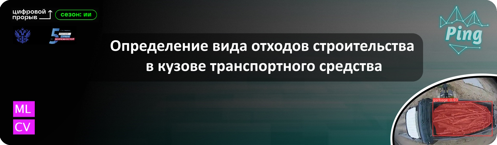
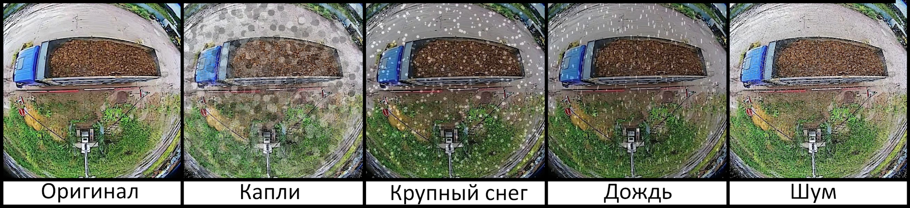

<div align="center">
  
</div>

## <div align="center">Стэк технологий📑</div>
<div align="center">
  <a href="https://www.python.org/doc/"></a>
  <a href="https://pytorch.org/docs/stable/index.html"></a>
  <a href="https://opencv.github.io/cvat/docs/"></a>
  <br>
  <a href="https://github.com/ultralytics/ultralytics/actions/workflows/ci.yaml"></a>
  <a href="https://docs.streamlit.io/"></a>
</div>

## <div align="center"><h1>О нашем решении📝</h1></div>
<details open>
<p>Мы представляем решение для автоматического распознавания содержимого кузовов самосвалов на видеофрагментах в рамках четырёх категорий перевозимого строительного мусора: кирпич, бетон, грунт, дерево.</p>
<h2>В чем уникальность нашего решения?</h2>
<p>Повышенная точности за счет последовательного применения различных моделей;<br>
Использование дополнительно аугментированных датасетов при обучении моделей;<br>
Возможность дополнительного повышения точности за счет использования опционального ансамблирования моделей;</p>
</details>

## <div align="center"><h1>Быстрый старт🎢</h1></div>
<details open>
  
#### Установка зависимостей
<p>
Для запуска проекта необходимо установить зависимости. Необходимые для работы проекта библиотеки можно посмотреть в файле <a href="https://github.com/Purpurum/GarbagePi/blob/main/requirements.txt">requirements.txt</a> и установить их вручную. Также можно воспользоваться командой:
</p>
  
```bash
$ pip install -r requirements.txt
```

#### Запуск пользовательского интерфейса
<p>
  Для удобной демонстрации работы с моделями детекции отходов строительства можно воспользоваться разработанным нашей командой пользовательским интерфейсом, для его запуска необходимо выполнить следующую команду в папке репозитория: 
</p>
  
```bash
$ streamlit run newUi.py
```
<p>
  Данная команда запускает веб приложение разработанное на базе фреймворка <a href="https://streamlit.io/">Streamlit</a>. 
</p>  

<p>
Если данная команда вместо запуска вернула ошибку об отсутствии streamlit как команды, то необходимо запускать его через команду ниже
</p>

```bash
$ python -m streamlit run newUi.py
```

#### Альтернативный запуск без UI
<p>
  Для предпросмотра работы моделей без запуска пользовательского интерфейса можно воспользоваться <a href="https://jupyter.org/">Jupiter</a> блокнотом, данный блокнот лежит в репозитории проекта <a href="https://github.com/Purpurum/GarbagePi/blob/main/GarbDetector.ipynb">GarbDetector.ipynb</a> 
</p> 
</details>

## <div align="center"><h1>Подготовка данных🗂</h1></div>
<details open>
<p>
  Для решения задач сегментации, детекции и классификации были подготовлены, очищены и размеченны три датасета. Собранные данные были искуственно увеличены (аугментированы), путем добавления масок с погодными эфектами. Данный способ аугментации обучающей выборки позволяет повысить точность работы нейронных сетей, которые в дальнейшем будут обрабатывать данные с уличных камер.

  #### Пример аугментации:
  
</p>
</details>

## <div align="center"><h1>Модели🧱</h1></div>
<p>
  В своем проекте мы решили несколько задач компьютерного зрения (CV), такие как:<br>
  - классификация;<br>
  - cегментация;<br>
  - детекция.<br>
  Для решения данных задач мы использовали модель архитектуры YOLOv8m. Данная архитектура имеет большой спектр возможностей для работы с CV. Благодаря качественно подготовленным данным нам удалось обучить несколько моделей YOLOv8m, которые выполняют разные задачи.       
</p>
<div align="center">

  #### Схема работы ансамбля 
  
</div>

## <div align="center">Результат работы моделей🔮</div>
<p>
  В разработанном приложении есть возможность детекции ТБО на картинках(jpg,png,tif,tiff) и видео(mp4, mkv, камера реального времени), результатом работы алгоритма является подсчет уникальных элементов, таких классов как: дерево, стекло, металл и пластик. Примеры работы приложения на разных типах данных:
</p>

<div align="center">
  </a>
</div>

