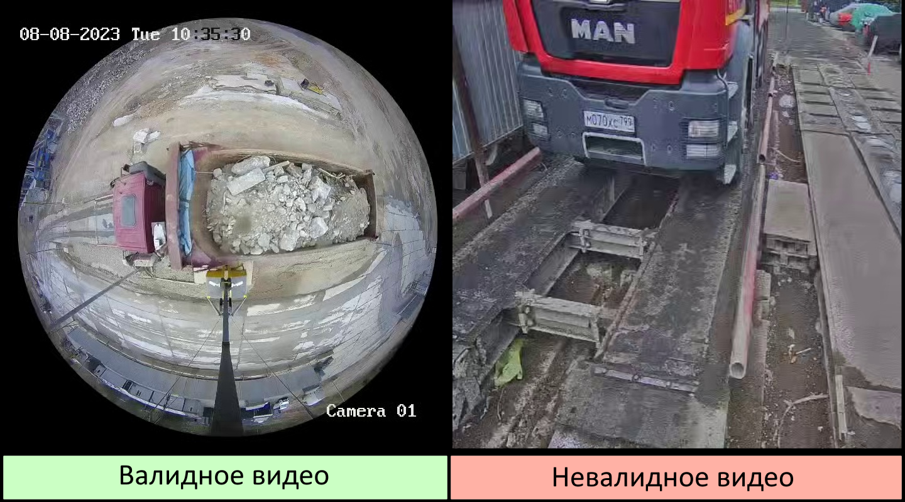
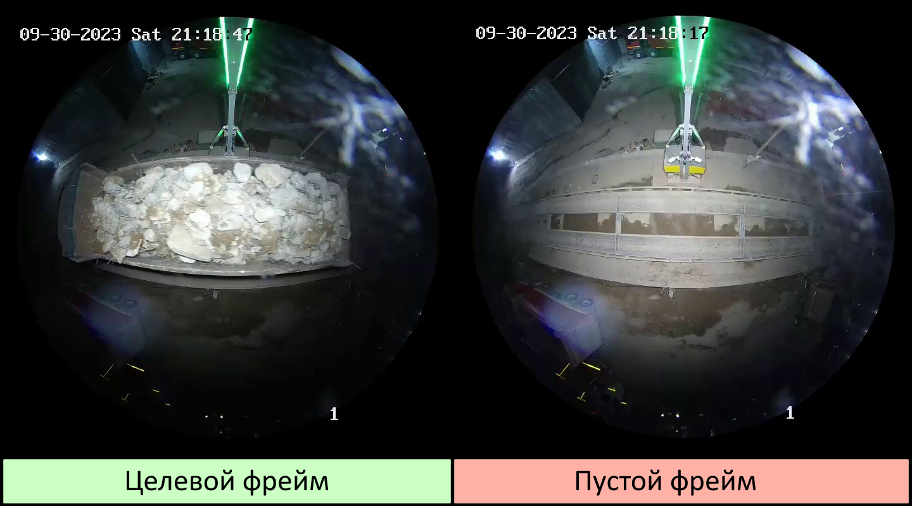
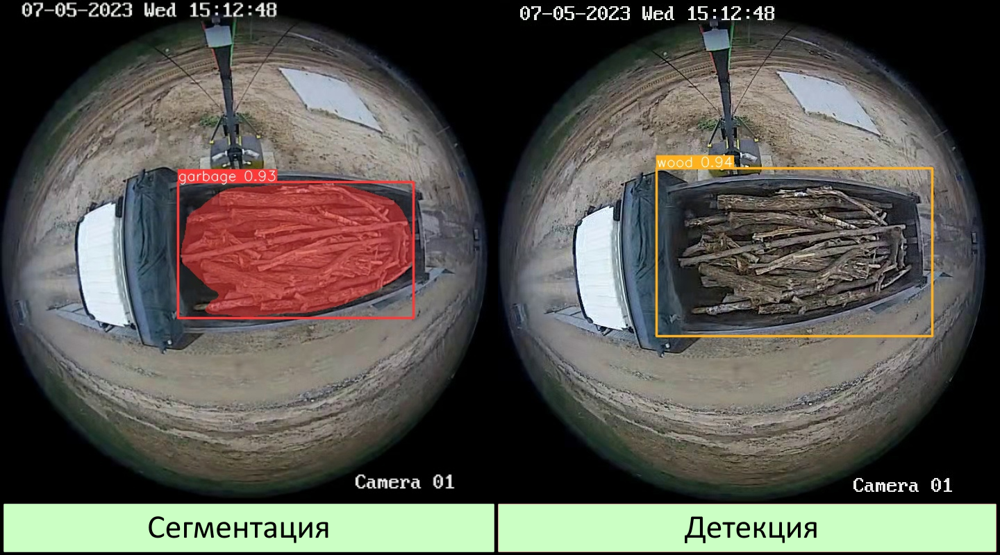
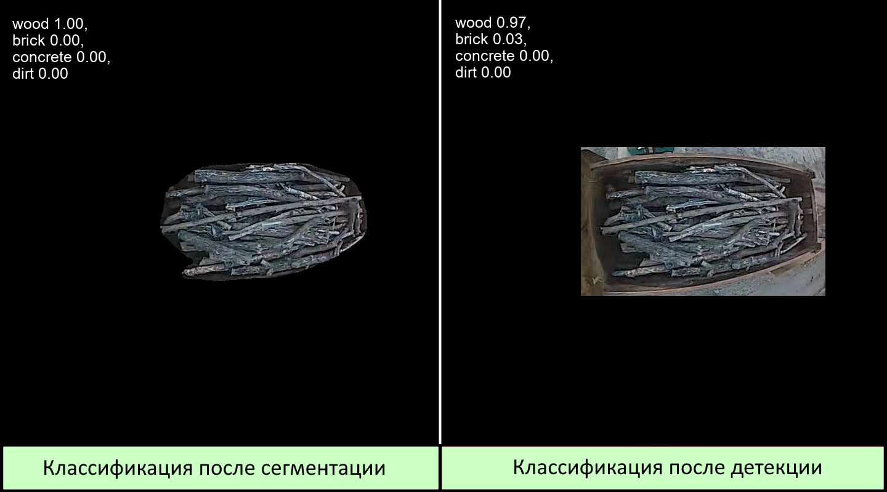

<div align="center">
  
</div>

## <div align="center">Стэк технологий📑</div>
<div align="center">
  <a href="https://www.python.org/doc/"></a>
  <a href="https://pytorch.org/docs/stable/index.html"></a>
  <a href="https://opencv.github.io/cvat/docs/"></a>
  <br>
  <a href="https://github.com/ultralytics/ultralytics/actions/workflows/ci.yaml"></a>
  <a href="https://docs.streamlit.io/"></a>
</div>

## <div align="center"><h1>О нашем решении📝</h1></div>
<details open>
<p>Мы представляем решение для автоматического распознавания содержимого кузовов самосвалов на видеофрагментах в рамках четырёх категорий перевозимого строительного мусора: кирпич, бетон, грунт, дерево.</p>
<h2>В чем уникальность нашего решения?</h2>
<p>Повышенная точности за счет последовательного применения различных моделей;<br>
Использование дополнительно аугментированных датасетов при обучении моделей;<br>
Возможность дополнительного повышения точности за счет использования опционального ансамблирования моделей;</p>
</details>

## <div align="center"><h1>Быстрый старт🎢</h1></div>
<details open>
  
#### Установка зависимостей
<p>
Для запуска проекта необходимо установить зависимости. Необходимые для работы проекта библиотеки можно посмотреть в файле <a href="https://github.com/Purpurum/GarbagePi/blob/main/requirements.txt">requirements.txt</a> и установить их вручную. Также можно воспользоваться командой:
</p>
  
```bash
$ pip install -r requirements.txt
```

#### Запуск пользовательского интерфейса 🙌
<p>
  Для удобной демонстрации работы с моделями детекции отходов строительства можно воспользоваться разработанным нашей командой пользовательским интерфейсом, для его запуска необходимо выполнить следующую команду в папке репозитория: 
</p>
  
```bash
$ streamlit run newUi.py
```
<p>
  Данная команда запускает веб приложение разработанное на базе фреймворка <a href="https://streamlit.io/">Streamlit</a>. 
</p>  

<p>
Если данная команда вместо запуска вернула ошибку об отсутствии streamlit как команды, то необходимо запускать его через команду ниже
</p>

```bash
$ python -m streamlit run newUi.py
```

#### Альтернативный запуск без UI 👏
<p>
  Для предпросмотра работы моделей без запуска пользовательского интерфейса можно воспользоваться <a href="https://jupyter.org/">Jupiter</a> блокнотом, данный блокнот лежит в репозитории проекта <a href="https://github.com/Purpurum/GarbagePi/blob/main/GarbDetector.ipynb">GarbDetector.ipynb</a> 
</p> 
</details>

## <div align="center"><h1>Подготовка данных🗂</h1></div>
<details open>
<p>
  Для решения задач сегментации, детекции и классификации были подготовлены, очищены и размеченны три датасета. Собранные данные были искуственно увеличены (аугментированы), путем добавления масок с погодными эфектами. Данный способ аугментации обучающей выборки позволяет повысить точность работы нейронных сетей, которые в дальнейшем будут обрабатывать данные с уличных камер.

  #### Пример аугментации💧❄🌨
<div align="center">
  
</div>
</p>
</details>

## <div align="center"><h1>Модели🧱</h1></div>
<details open>
<p>
  В своем проекте мы решили несколько задач компьютерного зрения (CV), такие как:<br>
  ✔классификация;<br>
  ✔cегментация;<br>
  ✔детекция.<br><br>
  Для решения данных задач мы использовали модели архитектуры <a href="https://github.com/ultralytics/ultralytics/actions/workflows/ci.yaml">YOLOv8✨</a>. Данная архитектура имеет большой спектр возможностей для работы с CV. Благодаря качественно подготовленным данным нам удалось обучить несколько моделей <a href="https://github.com/ultralytics/ultralytics/actions/workflows/ci.yaml">YOLOv8✨</a>, которые выполняют разные задачи:<br>
  ✔Первое что делает наша система- это бинарная класификация видеозаписей. В ходе изучения сырых данных были обнаружены видеофрагменты, которые не являются валидными. Случайные записи, неправильный ракурс съемки. Первая модель отбраковывает невалидные данные, что позволяет исключить ошибки на следующих этапах работы.<br>
<div align="center">
  
</div><br>
  ✔Вторая модель также является классификатором. Она, в свою очередь, занимается классификацией фреймов видеозаписи. Изучая данные, мы обнаружили некоторые пробелы в установленных временных рамках, и пришли к единому мнению что их необходимо обнаруживать и удалять на ранних этапах. Под пробелами подразумеваются фреймы видеозаписи на которых нет самосвалов. В результате своей работы вторая модель возвращает только те фреймы, на которых была обноружена взвешиваемая техника и видно содержимое кузова. Это позволило уменьшить количество данных, которые в дальнейшем будут использованы другими моделями, и предотвратить вероятность случайной детекции в дальнейшем.<br><br>
<div align="center">
  
</div><br>
✔Третья и четвертая модели выполняют схожие задачи, но разными способами. Это одна из ключевых идей, связанная с опциональностью нашего решения. Мы обучили две модели, одна сегментирует область содержимого кузова и передаёт дальше, другая делает тоже самое детектором объектов. Благодаря данной дифференциации мы сможем дать кейсодержателю вариативность в настройке системы, так как оба варианта хороши❕❕❕ Сегментация имеет относительно низкую скорость обработки видеоданных, но дальнейшая классификация на таких данных работает немного точнее, в свою очередь детектор имеет наиболее высокую скорость обработки, но жертвует малым процентом качества на следующем этапе. В разработанном нами интерфейсе предусмотрена функция переключения между подходами.<br><br>
<div align="center">
  
</div><br>  
✔Пятая "модель" это ансамбль из трех классификаторов, которые обучены на разных данных (кропах, сегментах, кропах-сегментах). Финальный результат классификации видео вычисляется голосованием этих моделей. Ансамбль с голосованием позволили нам поднять точность предсказаний нашего решения.<br><br>
<div align="center">
  
</div><br>   
</p>
</details>

<div align="center">
  
  #### Схема-пайплайн работы системы
  
</div>

## <div align="center"><h1>Результат работы моделей🔮</h1></div>
<p>
  В разработанном приложении есть возможность детекции на одном видео(mp4, mkv) или загрузкой данных архивом (zip). Результатом работы алгоритма является классификация видеофрагментов. Примеры работы приложения на разных типах данных:
</p>

<div align="center">
  </a>
</div>

